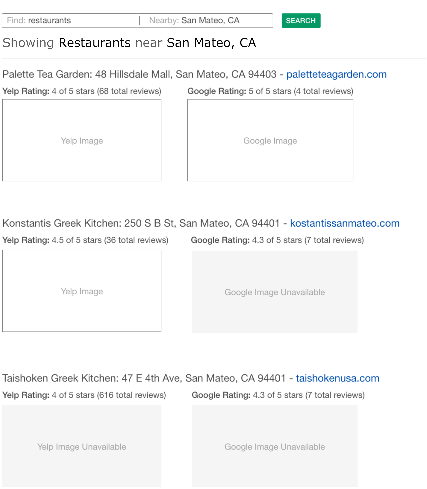

# Intellimize Frontend Engineering Simulation

### Getting Started
- Pull down package
- Gather required environment variables for .env file
   - REACT_APP_PROXY_DOMAIN
   - REACT_APP_YELP_API
   - REACT_APP_GOOGLE_API
   - REACT_APP_DEFAULT_RADIUS_METERS
- Run ```npm run start``` on root directory

### Preview


For this exercise, you will be creating a mini React web application to display search results from Yelp’s Business Search API and Google’s Places API to provide a side-by-side comparison of local businesses.

## Requirements

1. Using text inputs, the user should be able to query Yelp and/or Google using a search _term_ and _location_.
2. After the user submits the query, show the search term and location above the search results, i.e. "Showing <term> near <location>"
3. For each of the top 15 search results returned from the API(s), display the following:

     - The _name_ and _address_ of the business
     - The _rating_ on Yelp (X of 5 stars) and _review total_
     - The _rating_ on Google (X of 5 stars) and _rating total_
     - An _image_ of the business from Yelp
     - A _photo_ of the business from Google
     - A _url_ of the business’ website as a _hyperlink_

## Points of emphasis

- Put yourselves in the shoes of the end user when making decisions about the UI & UX. Be ready to provide reasoning behind your decisions and consider the pros/cons of different approaches.
- Try to create the best system design possible. Think about how and where you would manage API calls & data, state, business logic, and component hierarchy
- Think about the optimal way to match businesses between Yelp and Google. There is no right answer - but there are tradeoffs for the different decisions. Be ready to talk about those.

## Wireframe

Use the following wireframe as a general guideline when developing.

We encourage you to style as you see fit and will be reviewing how you structure your components and styling.




## TypeScript

We encourage you to use [TypeScript](https://www.typescriptlang.org/), as we use it extensively at Intellimize.

TypeScript is not enabled by default. It is understood that some engineers may have little or no experience with TypeScript, and it is not a hard requirement.

However, if you feel more comfortable using TypeScript, or would like to demonstrate your knowledge using it, you can convert the project by running:

```
npm run convert-to-typescript
```

> Once you convert the project to TypeScript, there is no automated script to convert the project back.

After the script completes, be sure to stop and restart the development server for the changes to take effect.

## APIs

Below you can find links to documentation as well as the authorization keys needed to use the APIs necessary to complete the simulation.

### Yelp

The API Key will grant access to the [Yelp Fusion Business Search API](https://www.yelp.com/developers/documentation/v3/business_search)

##### API Key


**IMPORTANT:** In order for the APIs to work from the browser, all requests must go through the local node proxy (to circumvent CORS). To do so, replace the Yelp API host with `http://localhost:3000/api/yelp`.

For example, instead of using:

```
https://api.yelp.com/*
```

Use:

```
http://localhost:3000/api/yelp/*
```

### Google

The API Key will grant access to the [Google Places API](https://developers.google.com/maps/documentation/places/web-service/overview) and [Google Geolocation API](https://developers.google.com/maps/documentation/geolocation/overview)

##### API Key


**IMPORTANT:** In order for the APIs to work from the browser, all requests must go through the local node proxy (to circumvent CORS). To do so, replace the Google API host with `http://localhost:3000/api/google`.

For example, instead of using:

```
https://maps.googleapis.com/*
```

Use:

```
http://localhost:3000/api/google/*
```

## Developing the application

The section below contains information on how to install and run the application.

### Prerequisites

- `node` >= `8.10`
- `npm` >= `5.6`

[NodeJS Website](https://nodejs.org/en/)

### First time setup

Once you have the project downloaded locally, install dependencies from the project directory by running:

```
npm install
```

### Available scripts

In the project directory, you can run:

```
npm start
```

Runs the app in the development mode.

Open [http://localhost:3000](http://localhost:3000) to view it in the browser.

The page will reload if you make edits.
You will also see any lint errors in the console.

```
npm test
```

Launches the test runner in the interactive watch mode.

```
npm run build
```

Builds the app for production to the `build` folder.
It correctly bundles the application in production mode and optimizes the build for the best performance.

The build is minified and the filenames include the hashes.
Your app is ready to be deployed!

```
npm run convert-to-typescript
```

See the section in this `README` on TypeScript for more information about why this script exists.


# Design Document for API calls

- The search bar will autocomplete a city or address, using the google places API
- We will then make a query for Yelp

## Option 1: Query Google Places for search results for that cuisine + location

### Pros: 
- 2 API calls
- Stich together the data and showcase that onto the page
### Cons:
- Missing data point from Google

Yelp API needs: city and term
Google API


## Option 2: Query each yelp result to Google places to find the reviews, google rating and google image
### Pros: 
- Accurate

### Cons:
- Slow
- Iterate through n number of Yelp results
- n number of API calls
